## Phase 2: JMeter Performance Testing

### Task 1: GUI Testing Results
Below are the screenshots of the JMeter GUI Summary Reports for each endpoint before optimization.

**Endpoint: `/all-student`**

**Endpoint: `/all-student-name`**
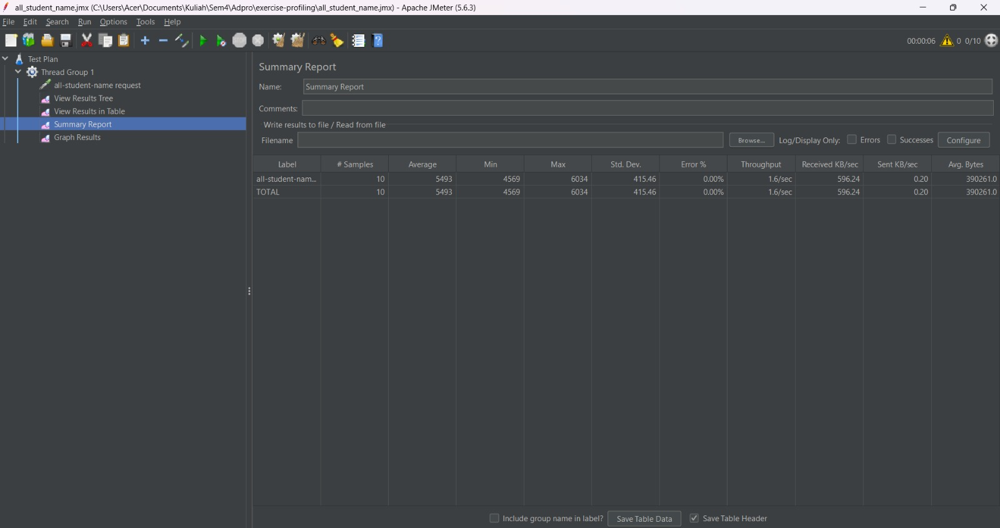

**Endpoint: `/highest-gpa`**
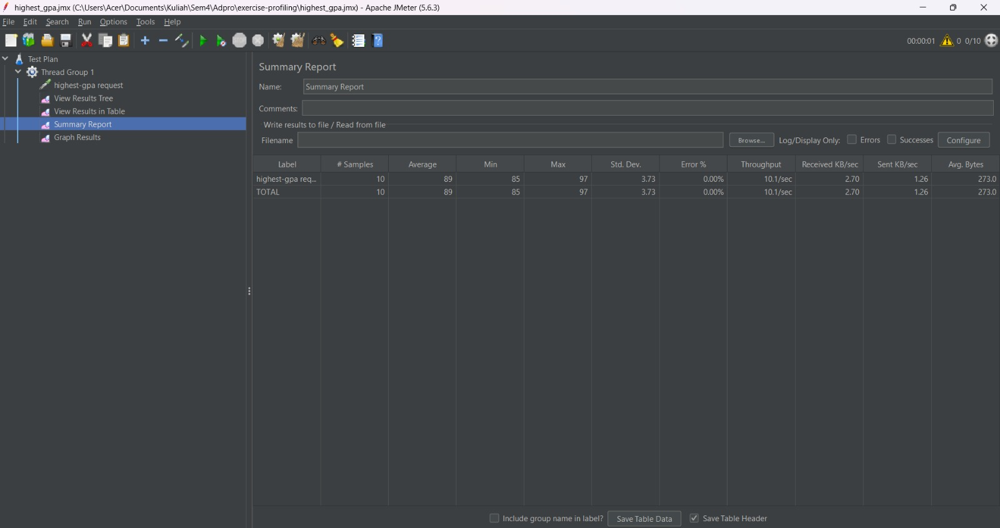

### Task 2: CLI Testing Results
Below are the screenshots of the command-line interface execution for the JMeter test plans.

**Endpoint: `/all-student`**
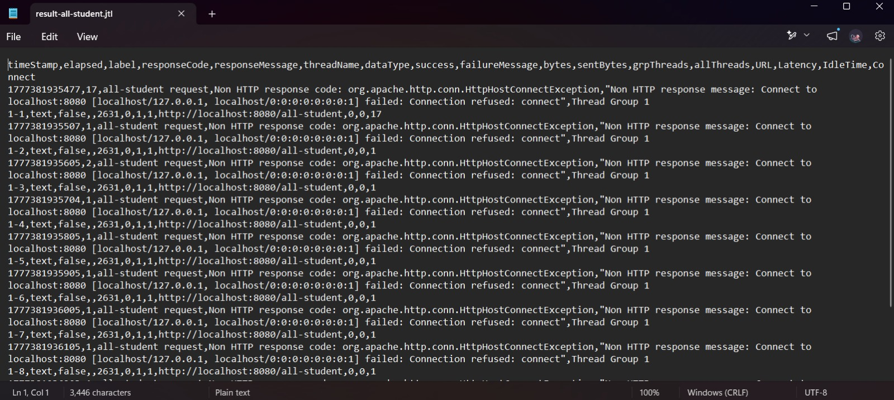

**Endpoint: `/all-student-name`**
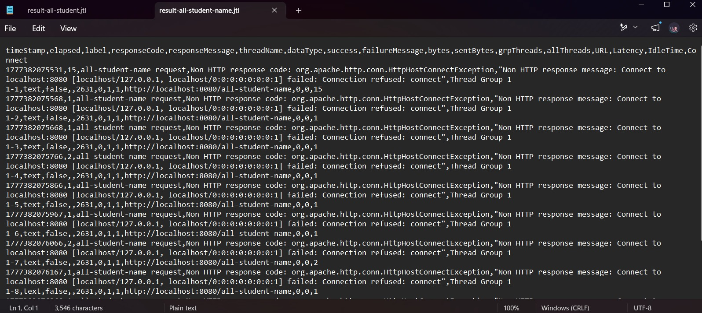

**Endpoint: `/highest-gpa`**
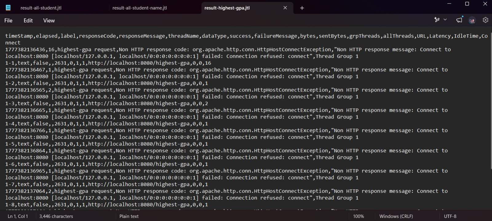

---

## Phase 3: Profiling & Optimization

### Task 3 & 4: Before and After Comparison

**1. `getAllStudentsWithCourses` (`/all-student`)**
* **Before Optimization:** 5,936 ms  
  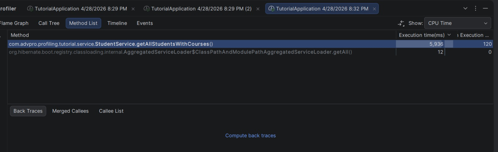
* **After Optimization:** 806 ms  
  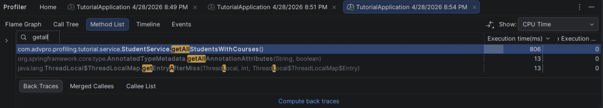
* **Improvement:** Reduced CPU execution time by 5,130 ms, achieving an **86.42%** improvement.

**2. `/all-student-name`**
* **Before Optimization:** 593 ms  
  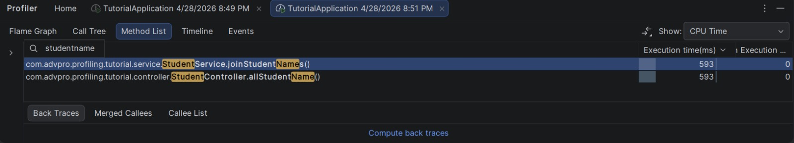
* **After Optimization:** 182 ms  
  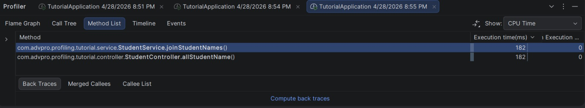
* **Improvement:** Reduced CPU execution time by 411 ms, achieving a **69.31%** improvement.

**3. `/highest-gpa`**
* **Before Optimization:** 182 ms  
  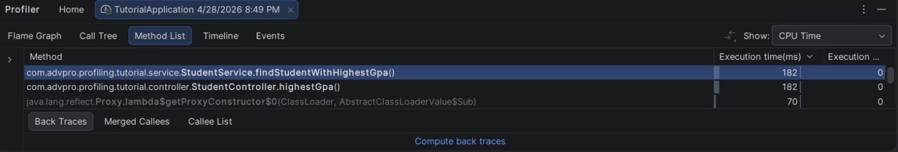
* **After Optimization:** 126 ms  
  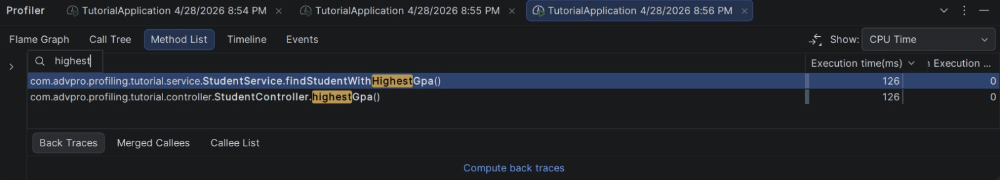
* **Improvement:** Reduced CPU execution time by 56 ms, achieving a **30.77%** improvement.

---

## Phase 4: Reflection

**1. What is the difference between the approach of performance testing with JMeter and profiling with IntelliJ Profiler in the context of optimizing application performance?**
> JMeter takes a "black-box" or macro approach. It simulates real-world load by sending multiple concurrent HTTP requests to measure external metrics like overall throughput, response times, and error rates under stress. In contrast, IntelliJ Profiler takes a "white-box" or micro approach. It hooks directly into the Java Virtual Machine (JVM) to monitor internal execution, tracking exactly how much CPU time and memory each specific method or line of code consumes. JMeter tells you *if* the application is slow, while the Profiler tells you *why* it is slow.

**2. How does the profiling process help you in identifying the weak points of your application?**
> Profiling replaces guesswork with hard data. Instead of assuming a method might be slow, tools like the Method List or Flame Graph show the exact percentage of CPU time a function takes. For example, the profiler definitively showed that `getAllStudentsWithCourses` was the primary bottleneck due to the N+1 query problem, taking up a massive portion of the execution time before it was refactored to use a single database fetch.

**3. Do you think the IntelliJ Profiler is effective in helping you find bottlenecks in your application's code?**
> Yes, it is highly effective. The Method List tab was particularly useful for pinpointing exact execution times down to the millisecond. This made it very easy to locate the inefficient loops and memory-heavy String concatenations, and later allowed for a precise comparison to verify that the optimizations (like reducing execution time from 5,936 ms to 806 ms) were successful.

**4. What were the main challenges you faced when doing performance testing and profiling, and how did you overcome them?**
> Several environment and setup challenges occurred:
> * **Tool Pathing:** Running commands like `mvn` or `jmeter` natively failed because they weren't in the Windows Environment Variables. I overcame this by using the Maven Wrapper (`.\mvnw`) and providing the absolute file path to the `jmeter.bat` file in PowerShell.
> * **Git Configuration:** My local repository was initially tied to the upstream author's remote URL instead of my own fork, preventing me from pushing. I fixed this by using `git remote set-url origin` to point to my personal GitHub repository.
> * **Code Refactoring Errors:** After optimizing the Java loops to push the sorting load to the database, I encountered a compilation error. I overcame this by remembering to update the `StudentRepository` interface with the correct `findFirstByOrderByGpaDesc()` method signature so Spring Boot could generate the appropriate SQL query.

**5. What are the main benefits you get from using JMeter and IntelliJ Profiler in the software development process?**
> Using them together creates a complete performance optimization loop. JMeter ensures the application meets its non-functional requirements (like SLAs for response times) under heavy user load. When JMeter reveals that a standard is not being met, the IntelliJ Profiler provides the exact diagnostic data needed to refactor the code efficiently. Together, they prevent shipping inefficient code (like N+1 queries or memory leaks) to production environments.